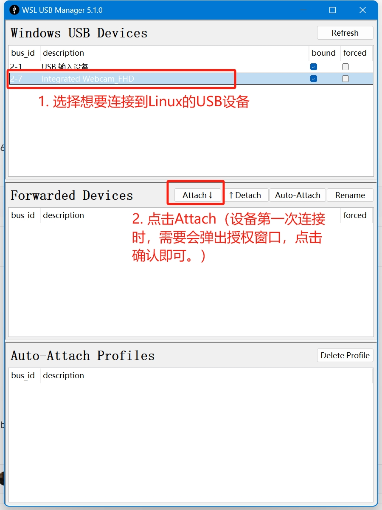

# windows note

## wsl2相关

导入导出发行版

```powershell
wsl --list
wsl --export <Distribution Name> <FileName>
wsl --import <Distribution Name> <InstallLocation> <FileName>
```

example

```powershell
wsl --list
wsl --export Ubuntu ubuntu-backup.tar
wsl --import Ubuntu-Cloned C:UsersUSERNAMEDistros C:ubuntu-backup.tar
```

就地导入发行版

```powershell
wsl --import-in-place <Distribution Name> <FileName>
```

通过 PowerShell 或 CMD 运行特定的 Linux 发行版

```powershell
wsl --distribution NAME-CLONED-DISTRO
wsl --distribution <Distribution Name> --user <User Name>
```

以特定用户的身份运行

```powershell
wsl -u <Username>`, `wsl --user <Username>
```

更改发行版的默认用户（此命令只适用于从应用商店安装的发行版）

```powershell
<DistributionName> config --default-user <Username>
```

## wsl2 访问usb设备

### 软件安装

1. 在Windows上安装usbipd，下载[usbipd-win](https://github.com/dorssel/usbipd-win/releases)并安装。

### 将USB设备连接到Linux

1. 在Windows上安装可视化的管理工具[WSL-USB](https://gitlab.com/alelec/wsl-usb-gui/-/releases)。



2. 使用Windows命令行连接

2.1 在Windows上以管理员身份打开power shell，查看BUSID

```powershell
usbipd list
```

2.2 附加一个usb设备到默认的Linux发行版，在power shell上执行以下命令：

```powershell
usbipd attach --wsl --busid <busid>
```

此外还可以使用 --distribution <Linux distribution> 来指定发行版，查看Linux的发行版可以使用一下命令查看

```powershell
wsl --list
usbipd attach --wsl --distribution <Linux distribution> --busid <busid>
```

2.3 在Linux设备上可以使用以下命令查看

```bash
lsusb
```

2.4 断开usb设备

在 WSL 中完成设备使用后，可物理断开 USB 设备，或者在管理员模式下从 PowerShell 运行此命令：

```powershell
usbipd detach --busid <busid>
```
