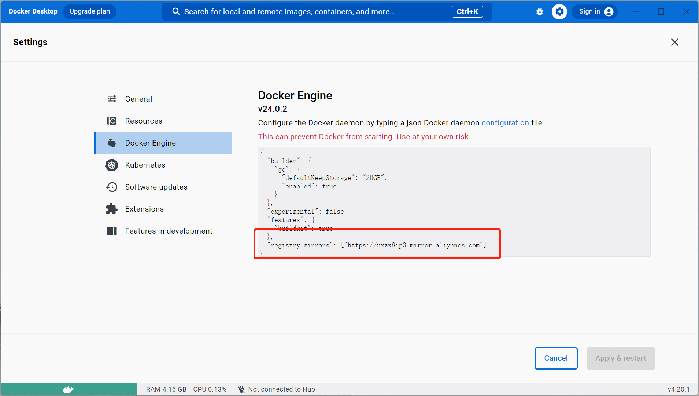

# docker 笔记

## docker for desktop

### 1. 更换镜像源



## ubuntu

### 1. 更换镜像源

```bash
sudo mkdir -p /etc/docker
sudo tee /etc/docker/daemon.json <<-'EOF'
{
  "registry-mirrors": ["https://uxzx8ip3.mirror.aliyuncs.com"]
}
EOF
sudo systemctl daemon-reload
sudo systemctl restart docker
```
