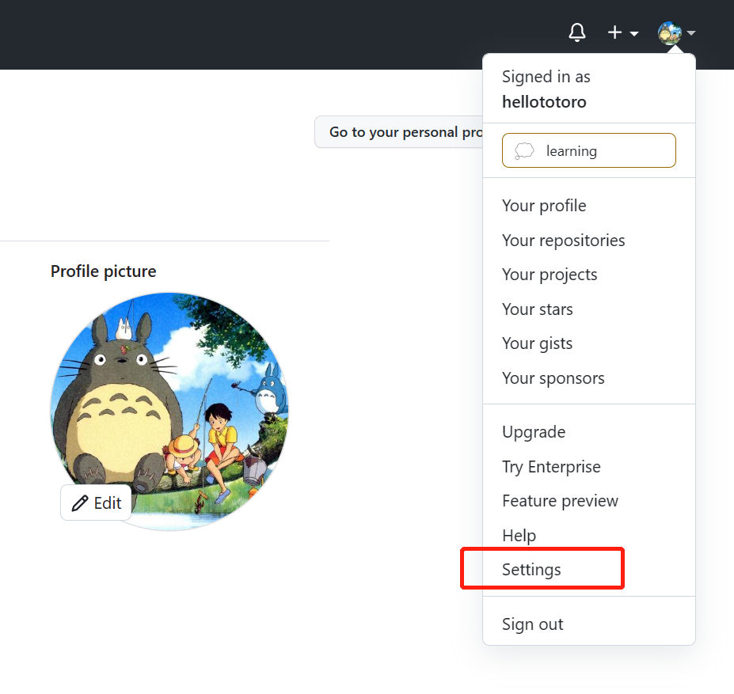
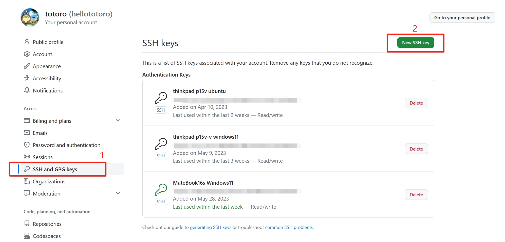

# git 笔记

## 1. 安装

Windows：[下载地址](https://git-scm.com/downloads)

Linux：

```bash
sudo apt update
sudo apt install git
```

## 2. 配置

### 2.1 设置个人信息

```bash
git config --global user.name "Your Name"
git config --global user.email "email@example.com"
```

查看

```bash
git config user.name
git config user.email
git config --list
```

### 2.2 关联GitHub

#### 2.2.1 生成ssh密钥

先查看是否已经生成ssh密钥

```bash
ls -al ~/.ssh
```

如果没有，则根据ssh/ssh.md生成ssh密钥

#### 2.2.2 GitHub添加ssh key

打开设置


根据ssh/ssh.md查看公钥，并添加公钥(sshkey)


#### 2.2.3 验证是否添加成功

```bash
ssh -T git@github.com
```

当看到如下内容时，表明添加成功

```bash
Hi <github id>! You've successfully authenticated, but GitHub does not provide shell access.
```

## 3. 使用

### 3.1 添加子仓库

本地仓库添加远程仓库作为子仓库

```bash
git submodule add https://github.com/xxx/xxx.git
```
