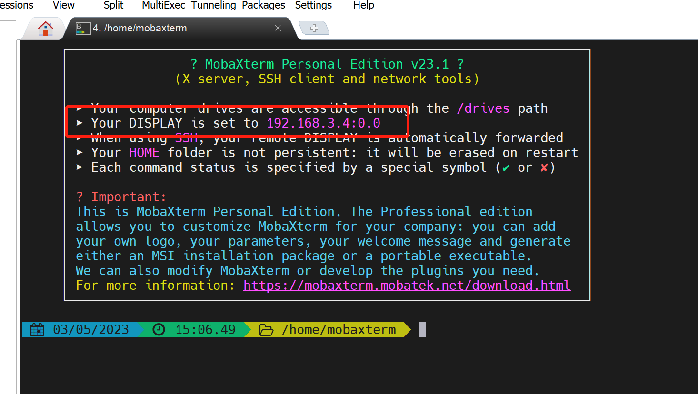

# ros2笔记

## 环境：Windows11 wsl2(Ubuntu22.04) docker desktop
1、安装 docker desktop(WSL2 后端)
[https://docs.docker.com/desktop/windows/wsl/#download](https://docs.docker.com/desktop/windows/wsl/#download)

2、拉取ros2的镜像（在wsl2中执行）
docker pull osrf/ros:humble-desktop

3、创建docker（在wsl2中执行）
docker run -it osrf/ros:humble-desktop

4、在docker中运行GUI程序
- 打开MobaXterm，并记录DISPLAY

- 在docker的终端上输入
```bash
export DISPLAY=<MobaXterm 上的值>
```
