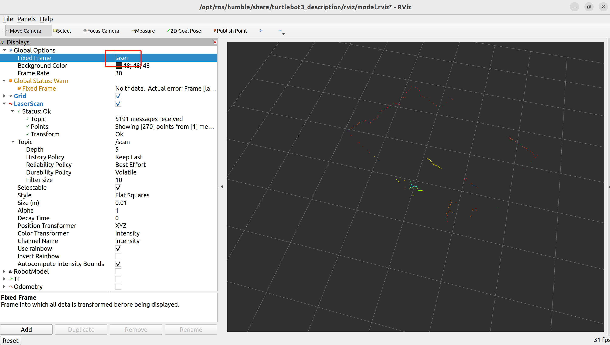

# LDS-01（360°激光距离传感器）

LDS-01是一种2D激光扫描仪，能够感知360°视角，收集机器人周围的一组数据，用于SLAM(同步定位和地图绘制)和导航。

## 基于ROS2（humble）的使用测试

### 1、安装turtlebot3（这里使用apt方式安装，另有源码安装[https://www.ncnynl.com/archives/202008/3842.html](https://www.ncnynl.com/archives/202008/3842.html)）
```bash
sudo apt update && sudo apt install ros-humble-turtlebot3*
```

### 2、启动LDS-01
将LDS-01连接到电脑上或者单板机上（LDS-01的接口是串口，一般串口转USB连接到电脑或单板机）
查看是哪一个设备
```bash
ls /dev | grep tty
```
一般为ttyUSB0，具体根据自己的电脑或单板机情况而定.
设置LDS-01的权限
```bash
sudo chmod a+rw /dev/ttyUSB0
```
启动LDS-01
```bash
ros2 launch hls_lfcd_lds_driver hlds_laser.launch.py
```

### 3、查看点云图
启动rviz2查看点云图，此路径根据实际情况更改
```bash
rviz2 -d /opt/ros/humble/share/turtlebot3_description/rviz/model.rviz
```
将rviz2中的 Display-->Globl Options-->Fixed Frame 设置为laser

