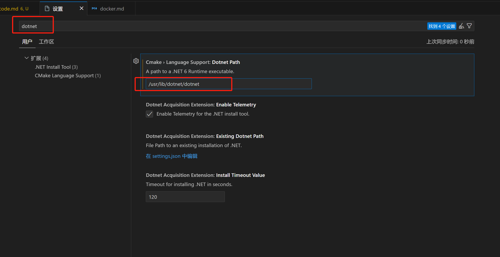

# Visual Studio Code note

## 1. 下载

下载地址[https://code.visualstudio.com/Download](https://code.visualstudio.com/Download)

## 2. 卸载

彻底卸载：
如果要在卸载 VS Code 后删除所有用户数据，可以删除用户数据文件夹.vscode。
这会将你返回到安装 VS Code 之前的状态。
如果您不想卸载 VS Code，这也可用于重置所有设置。
.vscode 文件夹位置因平台而异：
 - windows: .%APPDATA%\Code%USERPROFILE%\.vscode
 - macOS: .$HOME/Library/Application Support/Code~/.vscode
 - Linux: .$HOME/.config/Code~/.vscode

## 3. 插件安装

### 3.1 安装 .net 运行时
```bash
sudo apt-get update && sudo apt-get install -y aspnetcore-runtime-7.0
```
设置路径：打开设置界面，输入dotnet，选择 CMake Language Support，输入dotnet的路径

